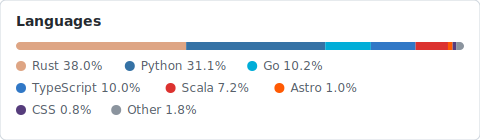

**New website, projects, demos, and blogs at [paulxie.com](https://paulxie.com)**

Old portfolio at [portfolio](https://github.com/paulxiep/portfolio)

## 📊 Languages

<!-- LANGS:START -->

<!-- LANGS:END -->

## 🛠 Tools & Tech

<!-- TOOLS:START -->
**Languages**

**Frontend**

**ML & AI**

**Data & DB**

**Backend & DevOps**

<!-- TOOLS:END -->
